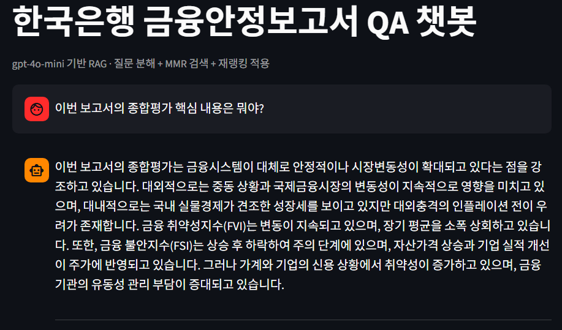
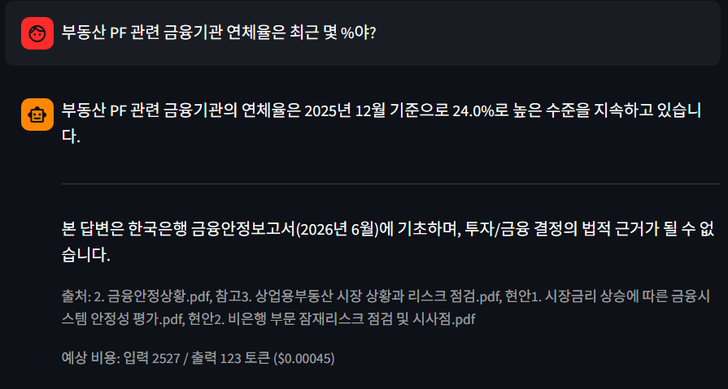
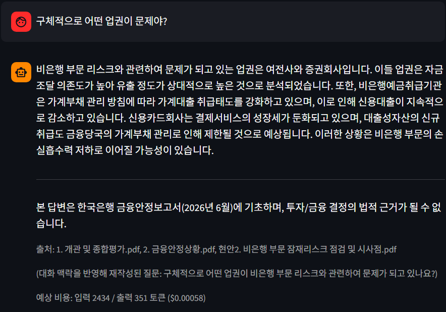

# 한국은행 금융안정보고서 RAG QA 챗봇

한국은행이 발간한 「금융안정보고서(2026년 6월)」를 지식베이스로 삼아 질의응답을 제공하는 RAG(Retrieval-Augmented Generation) 기반 챗봇입니다.

## 주요 기능

- PDF 원문을 임베딩하여 Chroma 벡터DB에 저장 (최초 1회만 임베딩, 이후 재사용)
- 질문 분해(query expansion) + MMR 검색 + LLM 재랭킹으로 검색 정확도 향상
- 이전 대화 맥락을 반영해 후속 질문을 독립 질문으로 재작성하는 대화형 검색
- Streamlit 기반 웹 UI, 사이드바에서 OpenAI API 키 입력

## 실행 화면

### 보고서 기반 질의응답

gpt-4o-mini 기반 RAG로 보고서 종합평가를 요약해 답변합니다.



### 출처 표시와 예상 비용

답변마다 근거가 된 PDF 출처, 면책 문구, 입력·출력 토큰 수와 예상 비용을 함께 표시합니다.



### 대화 맥락을 반영한 후속 질문

"구체적으로 어떤 업권이 문제야?"처럼 앞 대화에 기대는 질문을 독립 질문으로 재작성한 뒤 검색하고, 재작성된 질문을 화면에 보여줍니다.



## 기술 스택

Python, Streamlit, LangChain, ChromaDB, OpenAI API (GPT + Embeddings), PyPDF2 / pdfplumber

## 실행 방법

```bash
pip install streamlit langchain langchain_community langchain_openai langchain_text_splitters \
            langchain-classic chromadb openai tiktoken PyPDF2 pdfplumber

streamlit run app.py
```

실행 후 사이드바에 OpenAI API 키를 입력하면 사용할 수 있습니다.

## 참고 자료 (원본 데이터)

한국은행이 2026년 6월 발간한 「금융안정보고서」 및 관련 문서로, 챗봇의 지식베이스(RAG 소스)로 사용됩니다. 저작권 및 용량 문제로 저장소에는 PDF 원본을 포함하지 않으며(`.gitignore` 처리), 아래는 자료 목록입니다.

| 파일 | 설명 |
|---|---|
| 금융안정보고서(2026년 6월).pdf | 보고서 전체 원문 |
| FSR_Executive Summary (June 2026).pdf | 영문 요약본 |
| 1. 개관 및 종합평가.pdf | 전체 요약 및 종합 평가 |
| 2. 금융안정상황.pdf | 가계·기업·금융시스템 등 안정성 현황 |
| 3. 주요현안분석.pdf | 주요 리스크 이슈 분석 |
| 4. 자영업 구조 변화에 따른 리스크 점검 및 대응방향.pdf | 자영업 구조 변화 리스크 분석 |
| 5. 부록.pdf | 통계 부록 |
| 6. 용어해설.pdf | 용어 설명 |
| 현안1. 시장금리 상승에 따른 금융시스템 안정성 평가.pdf | 금리 상승과 금융시스템 리스크 |
| 현안2. 비은행 부문 잠재리스크 점검 및 시사점.pdf | 비은행 부문 리스크 점검 |
| 참고1~7 | 가계 재무건전성, 기업부문 리스크, 상업용부동산, 가상자산, 부실여신, 외국인 증권자금, ESG 공시 등 세부 주제별 참고자료 |

> 실제 챗봇 임베딩에는 이 중 일부 파일만 사용됩니다 (`app.py`의 `PDF_FILES` 목록 참고).

## 폴더 구성

```
app.py                          # Streamlit 앱 본체
금융안정보고서_RAG_QA챗봇.ipynb   # 개발/실험용 노트북
chroma_db_fsr/                  # 벡터DB (git 제외)
*.pdf                           # 원본 자료 (git 제외)
```
